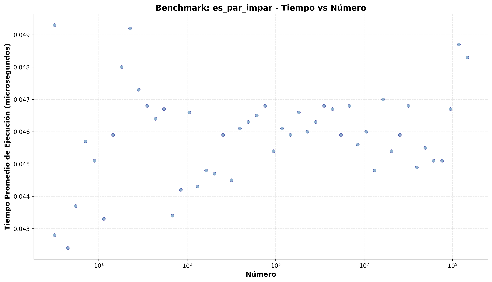
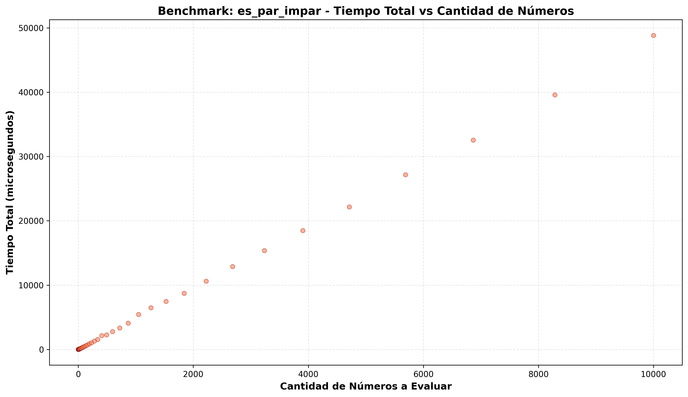
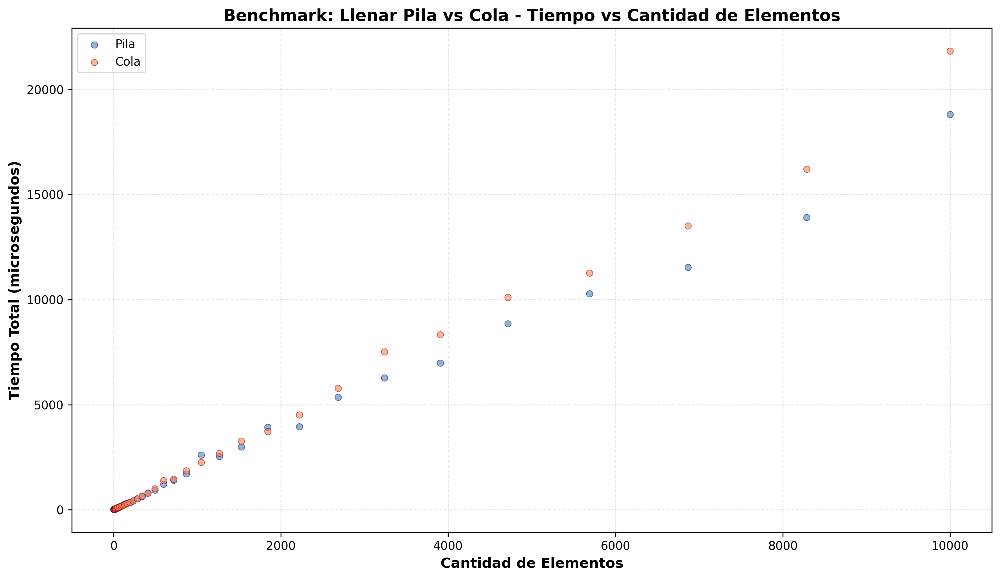
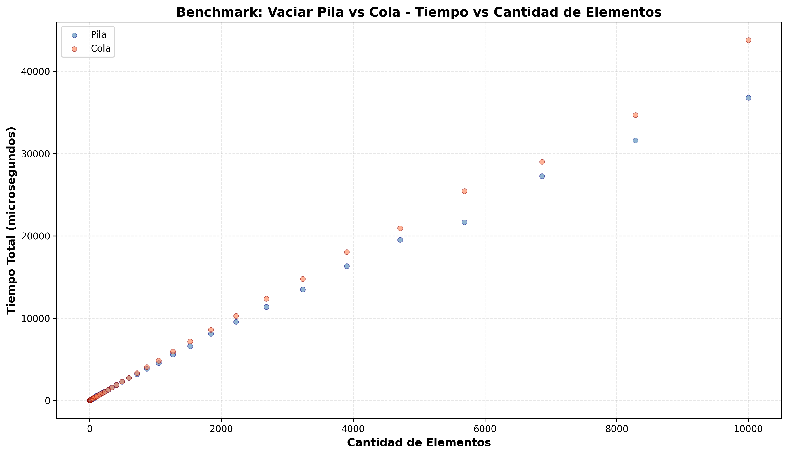
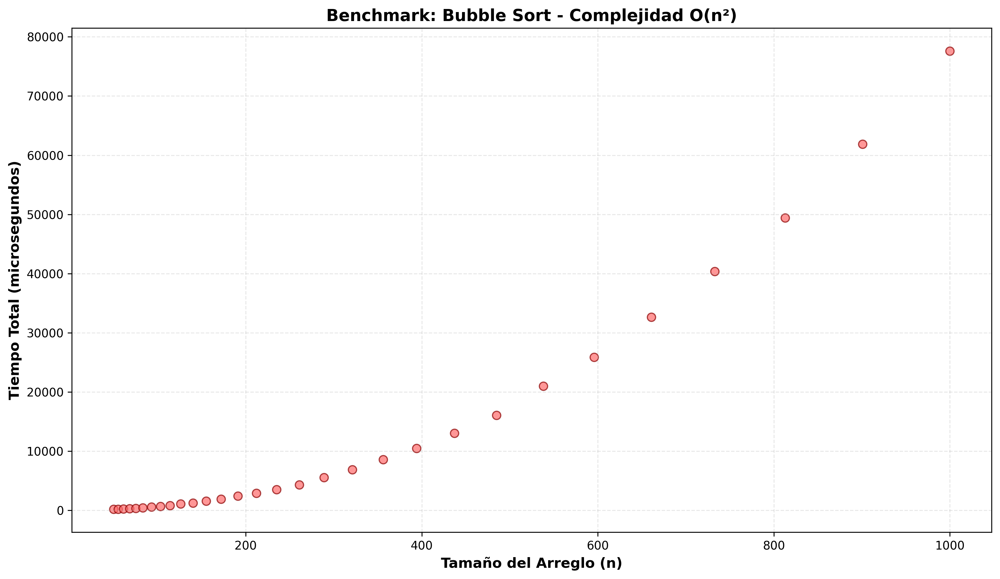
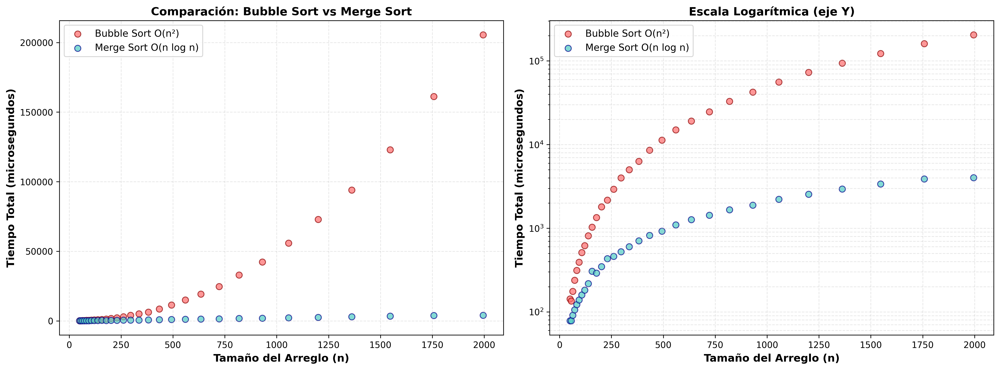
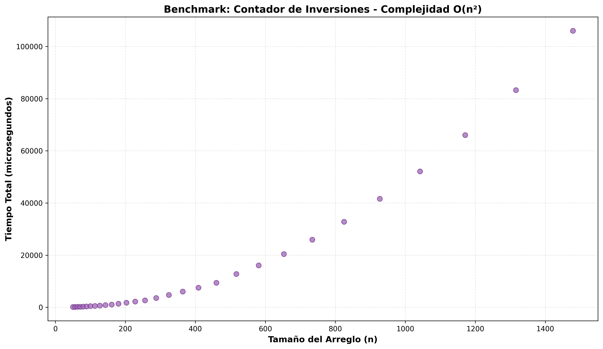
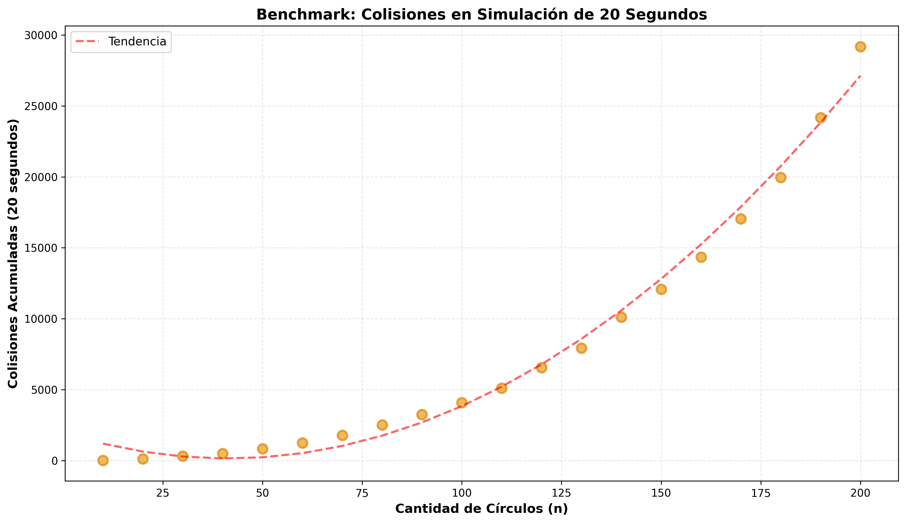
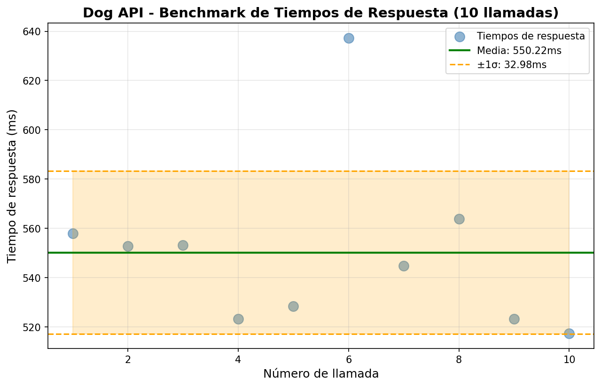

# Eficiencia de Algoritmos — Laboratorio de Complejidad Empírica

> Verificación empírica de la teoría Big O mediante medición de tiempos reales y visualización de datos.


---

## Qué es este proyecto

**Eficiencia-Algoritmos** es un laboratorio donde la teoría se convierte en datos reales. No solo se afirma que un algoritmo es O(n²)—se *ejecuta, se mide y se grafica*.

En informática, describimos la eficiencia de los algoritmos usando **notación Big O**: un lenguaje que captura cómo crece el tiempo de ejecución cuando el tamaño de la entrada aumenta. Este repositorio transforma esa teoría abstracta en evidencia empírica: cada algoritmo tiene un benchmark correspondiente que genera una gráfica scatter mostrando exactamente cómo se comporta en la práctica.

### Metodología

- **Medición**: Usamos `time.perf_counter()` para obtener tiempos de nanosegundo.
- **Repetición**: Cada experimento se ejecuta múltiples veces para promediar el ruido del sistema operativo.
- **Visualización**: Las gráficas son scatter plots sin líneas de tendencia—dejamos que los datos hablen por sí solos.
- **Reproducibilidad**: Todo está automatizado y documentado. Puedes ejecutar cualquier benchmark desde cero.

---

## Fundamentos: Notación Big O

Si nunca has trabajado con Big O, esta sección te da lo mínimo necesario para entender el resto.

### Qué mide Big O

Big O describe cómo crece el **tiempo de ejecución** (o **memoria**) en función del tamaño de la entrada, denominado `n`.

Lo crucial: **Big O no mide el tiempo absoluto**. Mide la *forma* de la curva.

- Un algoritmo que siempre tarda 1 microsegundo es **O(1)**: constante, plano.
- Un algoritmo que tarda 1 microsegundo por elemento (n elementos) es **O(n)**: lineal, una línea recta.
- Un algoritmo que tarda 1 microsegundo por par de elementos es **O(n²)**: cuadrático, una parábola.

La forma es lo que importa porque determina qué tan rápido se hace inmanejable a medida que n crece.

### Las clases de complejidad en este laboratorio

| Complejidad | Nombre | Cómo crece | Dónde lo ves aquí |
|---|---|---|---|
| **O(1)** | Constante | No crece | `es_par_impar` |
| **O(n)** | Lineal | Directamente proporcional a n | `llenar_pila`, `vaciar_cola` |
| **O(n log n)** | Linealítmico | Casi lineal (muy cercano a O(n)) | `merge_sort` |
| **O(n²)** | Cuadrático | Explota rápidamente | `bubble_sort`, `contar_inversiones`, `contar_colisiones` |

### Cómo leer los gráficos

Cada gráfica en este laboratorio tiene:

- **Eje X**: El tamaño de la entrada (`n`), a menudo en escala logarítmica para cubrir un amplio rango.
- **Eje Y**: Tiempo medido en **microsegundos**, a menudo también en escala logarítmica.
- **Puntos**: Cada punto es una medición real. No hay suavizado ni líneas de tendencia—el ruido es genuino.

La **forma** de la nube de puntos revela la complejidad:
- Horizontal = O(1)
- Línea recta diagonal = O(n)
- Parábola curvada = O(n²)

---

## O(1) — Tiempo Constante

El tiempo no crece. Una operación simple que toma siempre el mismo tiempo, sin importar qué tan grande sea la entrada.

### Algoritmo: es_par_impar

Una función que determina si un número es par o impar:

```python
def es_par_impar(numero: int = 10) -> str:
    return "par" if numero % 2 == 0 else "impar"
```

Una sola operación: módulo. No importa si pasas 10 o 2,147,483,647—el tiempo es idéntico.

### Experimento 1: Tiempo vs Magnitud del Número

Se llama `es_par_impar` con números desde **1 hasta 2³¹-1** (más de 2 mil millones), espaciados logarítmicamente. Cada número se prueba 1,000 veces y se toma el promedio.



**Interpretación**: La nube de puntos es **completamente horizontal**. El tiempo promedio no cambia aunque el número crezca nueve órdenes de magnitud. Esto *es* O(1): el eje X literalmente no importa.

### Experimento 2: Tiempo Total vs Número de Llamadas

Ahora viene una lección crítica. ¿Qué pasa si llamas a `es_par_impar` dentro de un bucle?

Se ejecuta la función n veces (n = 1 a 10,000). El tiempo *total* crece linealmente.



**Interpretación**: Línea recta. ¿Por qué? Porque O(1) × n llamadas = O(n) en total. 

**Lección clave**: La complejidad de *una operación* (O(1)) ≠ la complejidad de *un bucle de operaciones* (O(n)).

---

## O(n) — Tiempo Lineal

El tiempo crece directamente proporcional a n. Duplicas el tamaño de entrada, el tiempo se duplica.

### Algoritmos: Pila y Cola

Una **pila** es una estructura LIFO (Last-In-First-Out): agregas elementos en la cima, quitas desde la cima.  
Una **cola** es FIFO (First-In-First-Out): agregas al final, quitas del frente.

Ambas son eficientes si las operaciones base (agregar, quitar) son O(1). Si agregas n elementos, el tiempo total es n × O(1) = **O(n)**.

### Experimento 3: Llenar Pila vs Cola

Se crean estructuras de tamaño n (1 a 10,000) y se llenan—cada elemento requiere exactamente una operación.



**Interpretación**: Dos líneas rectas prácticamente superpuestas. Ambas son O(n).

Nota interesante: `deque` (cola Python) es ligeramente más rápida que `list` (pila Python) para este caso. **Big O no te dice nada sobre esa diferencia**—ambas son O(n), pero tienen constantes multiplicativas ligeramente distintas. En la práctica, importa; en la teoría Big O, no.

### Experimento 4: Vaciar Pila vs Cola

Ahora se quitan elementos: la pila usa `.pop()` (LIFO), la cola usa `.popleft()` (FIFO).



**Interpretación**: Mismo patrón lineal. La mecánica es distinta (LIFO vs FIFO), pero el costo asintótico es idéntico.

---

## O(n²) — Tiempo Cuadrático

Ahora entramos en el territorio peligroso. La complejidad cuadrática crece *mucho* más rápido.

### Por qué O(n²) es problemático

| n | n² | Aumento |
|---|---|---|
| 10 | 100 | — |
| 100 | 10,000 | **100×** |
| 1,000 | 1,000,000 | **10,000×** |
| 10,000 | 100,000,000 | **1,000,000×** |

**Duplica n, y el tiempo se cuadruplica.** Multiplica n por 10, y el tiempo se multiplica por 100.

A esto se debe que los algoritmos O(n²) se vuelvan inmanejables rápidamente.

### Algoritmo: Bubble Sort

El algoritmo de ordenamiento más simple (pero menos eficiente):

```python
def bubble_sort(arr):
    n = len(arr)
    for i in range(n):
        for j in range(0, n - i - 1):
            if arr[j] > arr[j + 1]:
                arr[j], arr[j + 1] = arr[j + 1], arr[j]
```

Doble bucle anidado: por cada elemento, comparas con potencialmente todos los demás. Exactamente **n(n-1)/2 comparaciones** en el peor caso.

### Experimento 5: Bubble Sort

Se ordena un array de tamaño n (50 a 1,000), midiendo el tiempo total.



**Interpretación**: Una **parábola clara**. La curva muestra exactamente la forma n². 

El código también imprime la columna `Tiempo / n²`—esa relación es aproximadamente constante, confirmando empíricamente que la complejidad es cuadrática.

### Experimento 6: Bubble Sort vs Merge Sort — La Brecha que Importa

Este es el experimento más visualmente dramático. Comparamos:
- **Bubble Sort**: O(n²)
- **Merge Sort**: O(n log n) — divide y conquista, mucho más rápido



**Panel izquierdo (escala lineal Y)**:  
Para n pequeño, ambos son rápidos. Pero a medida que n crece, Merge Sort permanece casi plano mientras Bubble Sort sube como una parábola. La brecha se hace dramática: para n=2,000, Bubble Sort puede ser **50–100× más lento**.

**Panel derecho (escala logarítmica Y)**:  
Ambas curvas se vuelven líneas rectas (porque los logaritmos transforman potencias en pendientes). La pendiente más pronunciada (Bubble) confirma O(n²); la pendiente suave (Merge) confirma O(n log n).

**Lección**: La elección de algoritmo importa enormemente. O(n²) vs O(n log n) puede significar la diferencia entre segundos y horas para datos reales.

### Algoritmo: Contar Inversiones

Una inversión es un par (i, j) donde i < j pero arr[i] > arr[j]—una medida de "desorden" en un array.

```python
def contar_inversiones(arr):
    count = 0
    n = len(arr)
    for i in range(n):
        for j in range(i + 1, n):
            if arr[i] > arr[j]:
                count += 1
    return count
```

Doble bucle anidado sobre el mismo array: O(n²).

### Experimento 7: Contador de Inversiones

Se cuentan inversiones en arrays de tamaño n (50 a 1,500).



**Interpretación**: Misma parábola O(n²). El dominio del problema es distinto (conteo de desorden en lugar de ordenamiento), pero el patrón Big O es idéntico. O(n²) aparece siempre que hay un doble bucle anidado sobre la misma colección.

---

## O(n²) en Acción: Simulación de Colisiones

Aquí mostramos O(n²) en un contexto visual e interactivo que puedes sentir en tiempo real.

### El Problema: Detección de Colisiones

Tienes n círculos en un espacio 2D. ¿Cuántos pares colisionan?

Para encontrarlo, debes probar cada par posible: **n(n-1)/2 pares**.

- 10 círculos → 45 comparaciones por frame.
- 100 círculos → 4,950 comparaciones por frame.
- A 60 fps → 297,000 comparaciones por segundo.

Con 100 círculos, la detección de colisiones se vuelve un cuello de botella. Ese es O(n²) siendo tangible.

### Experimento 8: Colisiones Acumuladas vs Número de Círculos

Se simula 20 segundos de física de círculos rebotando (con colisiones elásticas), contando el número total de colisiones para cada n (10 a 200 círculos).



**Interpretación**: Cada punto es una simulación completa de 20 segundos. La curva de tendencia polinomial (línea roja) confirma el crecimiento cuadrático.

A diferencia de los benchmarks de algoritmos puros, aquí el resultado es el *número de colisiones detectadas*—que varía porque la física es estocástica. Pero el costo de *detectarlas* es puramente O(n²).

### Demo Interactivo: colisiones_pygame.py

Aquí es donde O(n²) se vuelve visceral.

```bash
uv run colisiones_pygame.py
```

Una ventana Pygame con círculos que rebotan con física elástica. **Agrega círculos en tiempo real** y observa cómo el framerate cae a medida que n crece.

**Controles**:
- **ESPACIO**: Pausar / Reanudar
- **`+` / `-`**: Agregar / quitar círculos (hasta 100)
- **L**: Mostrar / ocultar líneas de colisión entre pares
- **R**: Reset (reinicia la simulación)
- **ESC**: Salir

**Observa lo que pasa**: Con 10 círculos, la simulación es suave. Con 50, notas lag. Con 100, la detección de colisiones O(n²) domina completamente el tiempo de frame.

Eso es Big O haciéndose visible en tu pantalla.

---

## Más Allá de Big O: Latencia Externa

No toda variabilidad en el tiempo es complejidad algorítmica. A veces el factor dominante es *externo*.

### Experimento 9: API de Imágenes de Perros

Se hacen 10 llamadas HTTP a `https://dog.ceo/api/breeds/image/random`, midiendo la latencia de respuesta.



**Interpretación**: Scatter caótico. La gráfica muestra media (línea) y ±1 desviación estándar (banda sombreada).

No hay patrón algorítmico aquí. La variabilidad viene de:
- Latencia de red
- Congestión del servidor remoto
- DNS lookups
- Condiciones del ISP

**Lección**: Big O asume que el algoritmo domina el costo. Cuando la latencia externa es el factor principal, Big O simplemente no aplica. Necesitas otras herramientas (monitoreo de red, análisis de caché, etc.).

---

## Estructura del Repositorio

```
Eficiencia-Algoritmos/
│
├── algoritmos/                    # Implementaciones de algoritmos
│   ├── numeros.py                 # O(1): es_par_impar
│   ├── estructuras.py             # O(n): llenar/vaciar pila y cola
│   ├── ordenamiento.py            # O(n²) y O(n log n): bubble_sort, merge_sort
│   ├── pares.py                   # O(n²): contar_inversiones, encontrar_pares_suma
│   └── geometria.py               # O(n²): detección de colisiones de círculos
│
├── experimentos/                  # Benchmarks automatizados (9 scripts)
│   ├── 01_es_par_impar_benchmark.py
│   ├── 02_es_par_impar_cantidad_benchmark.py
│   ├── 03_estructura_llenar_benchmark.py
│   ├── 04_estructura_vaciar_benchmark.py
│   ├── 05_bubble_sort_benchmark.py
│   ├── 06_bubble_vs_merge_benchmark.py
│   ├── 07_contador_inversiones_benchmark.py
│   ├── 08_colisiones_benchmark.py
│   ├── 09_dog_image_benchmark.py
│   └── img/                       # Gráficas generadas (.png)
│
├── colisiones_pygame.py           # Demo interactivo de O(n²) con física
├── main.py                         # Punto de entrada básico
├── CLAUDE.md                       # Documentación para Claude Code
├── pyproject.toml                 # Configuración del proyecto
└── README.md                       # Este archivo
```

---

## Instalación y Uso

### Requisitos

- **Python**: 3.11+
- **Gestor de paquetes**: [uv](https://docs.astral.sh/uv/) (es lo único que usamos)

### Instalación

```bash
# Clonar el repositorio
git clone <url-del-repositorio>
cd Eficiencia-Algoritmos

# Sincronizar todas las dependencias
uv sync

# Agregar matplotlib y numpy (necesarias para los benchmarks)
uv add matplotlib numpy
```

Las dependencias base (pygame, pillow, requests) ya están en `pyproject.toml` y se instalan automáticamente con `uv sync`.

### Ejecutar un Benchmark Individual

```bash
# Cada experimento con su descripción
uv run experimentos/01_es_par_impar_benchmark.py           # O(1)
uv run experimentos/02_es_par_impar_cantidad_benchmark.py  # O(n) con O(1) operaciones
uv run experimentos/03_estructura_llenar_benchmark.py      # O(n): pila vs cola
uv run experimentos/04_estructura_vaciar_benchmark.py      # O(n): vaciado
uv run experimentos/05_bubble_sort_benchmark.py            # O(n²): bubble sort
uv run experimentos/06_bubble_vs_merge_benchmark.py        # O(n²) vs O(n log n)
uv run experimentos/07_contador_inversiones_benchmark.py   # O(n²): desorden
uv run experimentos/08_colisiones_benchmark.py             # O(n²): colisiones
uv run experimentos/09_dog_image_benchmark.py              # Latencia de red
```

### Ejecutar la Demo Interactiva

```bash
# Abre una ventana Pygame con círculos que rebotan
uv run colisiones_pygame.py
```

Controles: ESPACIO (pausar), +/- (agregar/quitar), L (líneas), R (reset), ESC (salir).

### Ejecutar el Punto de Entrada Principal

```bash
uv run main.py
```

Ejecuta `es_par_impar(10)` y mide el tiempo.

### Ejecutar Todos los Benchmarks

```bash
# Rápidos (segundos)
for i in {1..7}; do uv run "experimentos/0${i}_"*.py; done

# Lentos (minutos — incluye simulación de 20 segundos)
uv run experimentos/08_colisiones_benchmark.py

# Requiere conexión a internet
uv run experimentos/09_dog_image_benchmark.py
```

---

## Agregar Nuevos Experimentos

¿Quieres extender el laboratorio? Sigue esta receta:

### Checklist

1. **Implementar el algoritmo** en `algoritmos/nombre.py`:
   ```python
   def tu_algoritmo(entrada) -> resultado:
       """
       Breve descripción.
       
       Complexity:
           Time: O(?)
           Space: O(?)
       """
       # Tu código aquí
       return resultado
   ```
   - Usa type hints en la firma.
   - Documenta la complejidad en el docstring.

2. **Crear un benchmark** en `experimentos/NN_nombre_benchmark.py` (donde NN es el número secuencial):
   ```python
   import time
   import numpy as np
   import matplotlib.pyplot as plt
   from algoritmos.nombre import tu_algoritmo
   
   # Rango logarítmico de tamaños: 50 a 1000
   tamaños = np.logspace(np.log10(50), np.log10(1000), 20, dtype=int)
   tiempos = []
   
   for n in tamaños:
       entrada = generar_entrada(n)  # Tu función
       repeticiones = 10
       tiempos_rep = []
       
       for _ in range(repeticiones):
           inicio = time.perf_counter()
           tu_algoritmo(entrada)
           fin = time.perf_counter()
           tiempos_rep.append((fin - inicio) * 1e6)  # microsegundos
       
       tiempos.append(np.mean(tiempos_rep))
   
   # Graficar
   plt.figure(figsize=(10, 6))
   plt.scatter(tamaños, tiempos, alpha=0.6)
   plt.xlabel("Tamaño de entrada (n)")
   plt.ylabel("Tiempo (microsegundos)")
   plt.title("Benchmark: tu_algoritmo")
   plt.grid(True, alpha=0.3)
   plt.savefig("experimentos/img/tu_algoritmo_benchmark.png", dpi=100)
   plt.show()
   ```

3. **Medir múltiples veces** para reducir el ruido del sistema.

4. **Usar `np.logspace()`** para cubrir un amplio rango de n con pocos puntos.

5. **Crear scatter plots** sin líneas de tendencia—deja que los datos hablen.

### Principios de Benchmarking

- **Repetición**: Cada punto debe ser el promedio de 5–10 ejecuciones.
- **Rango**: Usa `np.logspace()` o `np.geomspace()` para exponencialmente más puntos (cubre órdenes de magnitud).
- **Ruido**: Los puntos no estarán perfectamente alineados—eso es normal. El ruido del SO y del kernel es real.
- **Validación**: Si sospechas O(n²), verifica que `Tiempo / n²` sea aproximadamente constante.

---

## Recursos

- **Big O Notation**: [Big O Cheat Sheet](https://www.bigocheatsheet.com/)
- **Python Performance**: [Official Python timeit docs](https://docs.python.org/3/library/timeit.html)
- **Visualización de Datos**: [Matplotlib docs](https://matplotlib.org/)

---

## Contribuciones

Este es un proyecto educativo. Si encuentras un error, una gráfica confusa, o una oportunidad para agregar un experimento, ¡abre un issue o un PR!

---

**Proyecto educativo** — Análisis empírico de complejidad algorítmica con Python 🚀

Mantén el código simple. Deja que los datos hablen.
